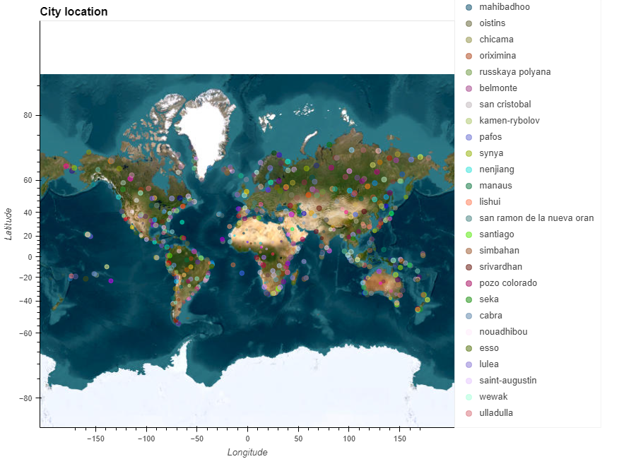
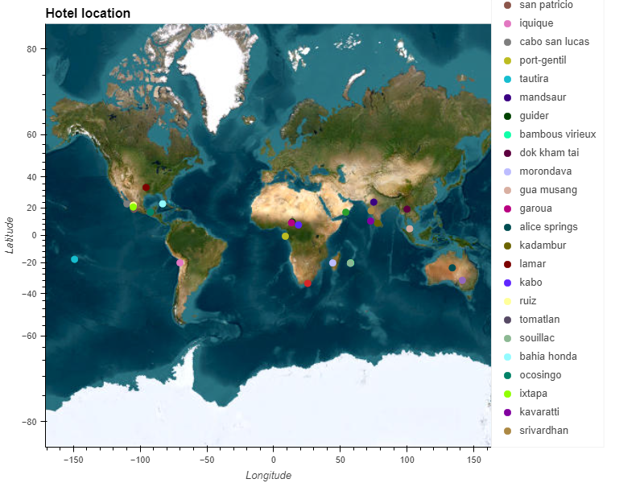

# Weather Analysis

## Introduction
This repository contains two jupyter notebooks:
* WeatherPy:
    * Creates a list of cities using `citipy`.
    * Requests weather characteristics such as temperature, humidity, cloudiness and wind speed from API.
    * Inputs these results into a Pandas DataFrame for better handling.
    * Plots these characteristics against the city's latitude.
    * Calculates a linear regression between the weather characteristics and the city's latitude.
* VacationPy:
    * Creates a map of the cities obtained in the last program.
    * Filters cities following desirable weather criteria, such as low wind speed, less cloudiness and comfortable temperatures.
    * Searches for hotels in these desirable cities.
    * Creates a new map of the filtered cities with a hover option to see the name of the hotel.

## Results

### WeatherPy
#### Latitude vs Maximum Temperature:

#### Latitude vs Humidity:

#### Latitude vs Cloudiness:

#### Latitude vs Wind Speed:

### VacationPy
#### Cities Map:

#### Hotels Map:
